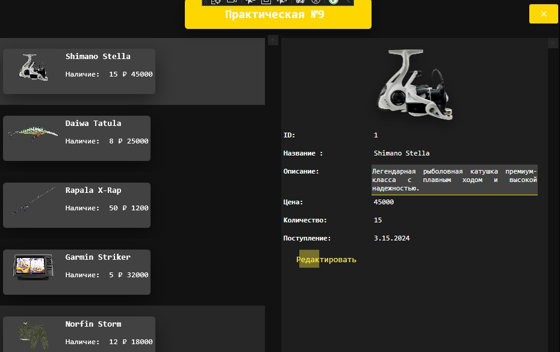
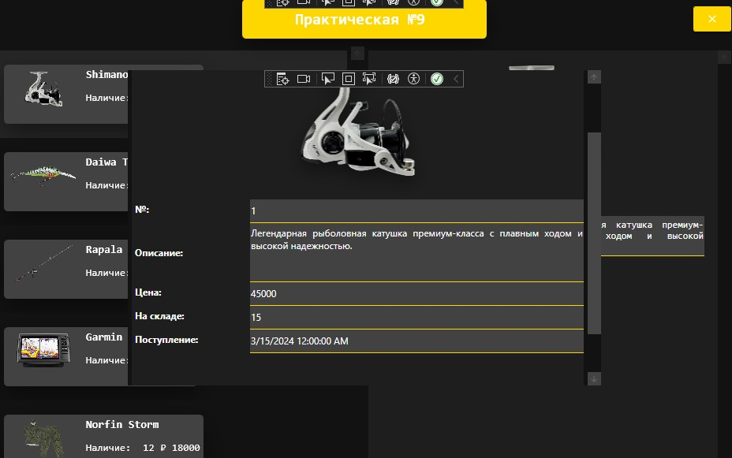

<h1>Практическая работа №9. Реализация паттерна MVVM</h1>

  WPF-приложение для управления товарным каталогом с:
  <ul>
    <li>Просмотром всего ассортимента</li>
    <li>Редактированием товарных позиций</li>
    <li>Удалением товаров из базы</li>
  </ul>

  <strong>Ключевые особенности:</strong>
  <ul>
    <li>Строгое следование паттерну MVVM</li>
    <li>Поддержка unit-тестирования</li>
   
  </ul>

  
  
  

